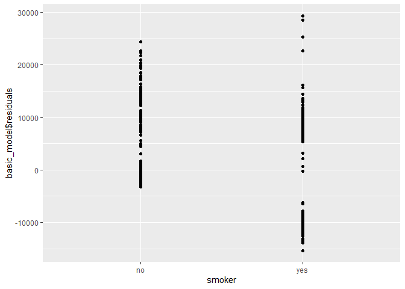
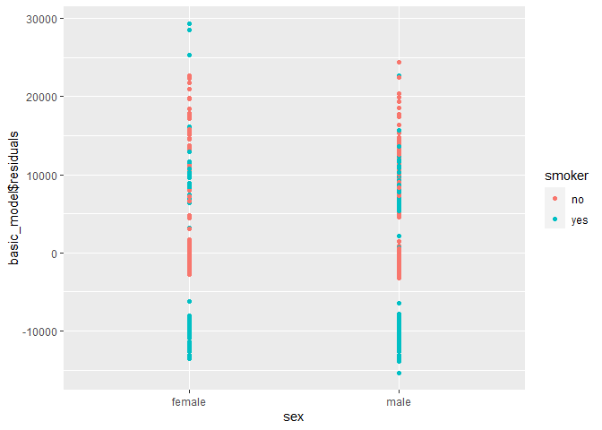

Prediction of Health Insurance Costs with Linear Regression (in R)
================


**Motivation:** Health insurance is a type of insurance that covers the
whole or a part of the risk of a person incurring medical expenses.
Health insurance companies desire to provide appropriate insurance for
each person such that it may enhance the resources allocation of the
company and may increase the loans they give.

**Goal:** Build a regression model which predicts health expenses for
potential insured based on their personal information.

**Data:** Tabular data with 1,338 records. Each record consists of
personal information about a potential insured. There are 7 explainable
variables: age, sex, bmi, smoker/nonsmoker, region, number of children
and family size. The response vector is the health expenses (in dolars)
of each potential insured. The data is obtained from the U.S only.

    ##   X age    sex  bmi children smoker    region family_size expenses
    ## 1 1  19 female 27.9        0    yes southwest           2 16884.92
    ## 2 2  18   male 33.8        1     no southeast           3  1725.55
    ## 3 3  28   male 33.0        3     no southeast           5  4449.46
    ## 4 4  33   male 22.7        0     no northwest           2 21984.47
    ## 5 5  32   male 28.9        0     no northwest           2  3866.86
    ## 6 6  31 female 25.7        0     no southeast           2  3756.62

### **Explanatory Analysis**

#### **Variables Distribution**


#### **Scatter plots for continues variables and semi-continues variables (age)**

<!-- -->

#### **Box plots**


It can be seen that smokers have higer health expensess.


Interesting to see that the expensess is getting higer untill
family\_size=5, and then start to deacreasing. mabe because there are
not many big families in the dataset.

<!-- --><!-- -->

## Scatter Plots

<!-- --><!-- -->


We can see from the figure “age vs expensess” that as the age getting
higer also does the expeness. In addition we can see that non-smokers
have low expensess compare to smokers, and that are 2-order polynomial
patterns for that in the plot. Therefore we may benfit from add an
interaction "’smoker\*age", as well as add the variable \(age^2\) to the
model.

We can see from the figure “bmi vs expensess”, that an interaction
"smoker\*age" may be relavnt too. In addition, BMI in the range 18.4-24
considerd as normal, while BMI over 30 is considerd as unhealty
condition. So we may benfit from add to the model an incdicator “bmi30”
which indicated whatever a indvidual has BMI of 30 or above

## More plots


## Check for Multicollinearity

    ## Tolerance and Variance Inflation Factor
    ## ---------------------------------------
    ##         Variables Tolerance      VIF
    ## 1             age 0.9832591 1.017026
    ## 2         sexmale 0.9910818 1.008998
    ## 3             bmi 0.9011468 1.109697
    ## 4        children 0.1074144 9.309743
    ## 5       smokeryes 0.9871087 1.013060
    ## 6 regionnorthwest 0.6582757 1.519120
    ## 7 regionsoutheast 0.6049398 1.653057
    ## 8 regionsouthwest 0.6538617 1.529375
    ## 9     family_size 0.1072980 9.319841
    ## 
    ## 
    ## Eigenvalue and Condition Index
    ## ------------------------------
    ##    Eigenvalue Condition Index    intercept          age      sexmale
    ## 1  5.91359282        1.000000 4.556759e-04 2.804394e-03 8.147346e-03
    ## 2  1.02312325        2.404151 2.974732e-06 5.192059e-05 2.956284e-04
    ## 3  1.00024641        2.431488 1.524044e-08 3.193212e-07 2.901034e-06
    ## 4  0.76046846        2.788593 4.122615e-05 5.759958e-04 1.883309e-03
    ## 5  0.57103160        3.218071 5.554057e-04 3.944513e-03 2.029686e-01
    ## 6  0.42915581        3.712088 1.259389e-03 1.432366e-02 7.440492e-01
    ## 7  0.19717810        5.476415 3.594827e-03 1.269644e-01 1.787257e-02
    ## 8  0.07380140        8.951451 3.128589e-02 8.256397e-01 2.259113e-02
    ## 9  0.02283277       16.093349 1.376013e-01 1.123846e-02 9.544794e-04
    ## 10 0.00856937       26.269467 8.252033e-01 1.445667e-02 1.234869e-03
    ##             bmi     children    smokeryes regionnorthwest regionsoutheast
    ## 1  9.125602e-04 1.010530e-03 5.989725e-03     0.003506740    0.0036667778
    ## 2  3.350507e-05 6.068282e-04 4.886192e-02     0.094935791    0.2467072842
    ## 3  6.159232e-06 2.068836e-06 1.465046e-04     0.238231296    0.0003936532
    ## 4  1.793768e-04 3.721110e-03 8.690098e-01     0.004258988    0.0388907557
    ## 5  1.346418e-03 5.479819e-02 6.557389e-02     0.017176758    0.0046428742
    ## 6  2.970947e-03 1.324332e-02 1.017941e-03     0.050179492    0.0409878856
    ## 7  6.586689e-03 4.587687e-03 1.361844e-03     0.525628933    0.5507253148
    ## 8  1.070690e-01 1.289824e-02 4.297835e-03     0.050464818    0.0955250943
    ## 9  6.935226e-01 1.954516e-01 3.673430e-03     0.009769880    0.0183716437
    ## 10 1.873727e-01 7.136804e-01 6.714632e-05     0.005847303    0.0000887164
    ##    regionsouthwest  family_size
    ## 1     0.0035451973 4.218362e-04
    ## 2     0.0732016859 6.447258e-05
    ## 3     0.2576192867 5.682779e-07
    ## 4     0.0043877705 3.565101e-04
    ## 5     0.0126071100 2.311238e-03
    ## 6     0.0479086328 9.891282e-05
    ## 7     0.5373102981 3.733628e-04
    ## 8     0.0598928192 7.540063e-03
    ## 9     0.0003153667 1.902161e-01
    ## 10    0.0032118328 7.986170e-01

It can be seen that “children” and “family\_size” are colinear with each
other (as expected). We can see it because they both have high VIF
(\~9), and becausein the row of condition index with high value (26.26),
thier variance proportions are close to 0.9. So we drop “children” and
reapt multicollinearity checking without it:

    ## Tolerance and Variance Inflation Factor
    ## ---------------------------------------
    ##         Variables Tolerance      VIF
    ## 1             age 0.9832597 1.017025
    ## 2         sexmale 0.9910953 1.008985
    ## 3             bmi 0.9037240 1.106532
    ## 4       smokeryes 0.9877898 1.012361
    ## 5 regionnorthwest 0.6582836 1.519102
    ## 6 regionsoutheast 0.6051822 1.652395
    ## 7 regionsouthwest 0.6539306 1.529214
    ## 8     family_size 0.9949292 1.005097
    ## 
    ## 
    ## Eigenvalue and Condition Index
    ## ------------------------------
    ##   Eigenvalue Condition Index    intercept          age      sexmale
    ## 1 5.35931548        1.000000 8.357460e-04 3.471467e-03 1.025144e-02
    ## 2 1.01706131        2.295520 2.361673e-05 1.679301e-04 6.287782e-08
    ## 3 1.00022029        2.314765 1.668498e-07 8.279473e-10 4.963721e-07
    ## 4 0.74698152        2.678550 2.562227e-04 1.771965e-03 2.472522e-04
    ## 5 0.45236856        3.441981 6.802001e-04 6.043699e-03 9.539814e-01
    ## 6 0.21226795        5.024727 1.906839e-03 4.549518e-02 1.019120e-02
    ## 7 0.12955337        6.431767 1.965706e-03 2.994280e-01 3.212780e-04
    ## 8 0.06587937        9.019448 6.104726e-02 6.060665e-01 2.163700e-02
    ## 9 0.01635215       18.103697 9.332842e-01 3.755529e-02 3.369860e-03
    ##            bmi    smokeryes regionnorthwest regionsoutheast regionsouthwest
    ## 1 1.133746e-03 7.657267e-03    0.0043148271    4.646674e-03     0.004379114
    ## 2 6.537426e-06 3.902802e-02    0.0965694034    2.474521e-01     0.085528324
    ## 3 5.540312e-06 9.191488e-05    0.2452591578    9.450865e-05     0.251077235
    ## 4 5.373376e-04 9.383318e-01    0.0004899561    3.924159e-02     0.000887696
    ## 5 1.005064e-03 7.166210e-03    0.0146431508    1.775423e-02     0.015309189
    ## 6 1.500496e-03 1.209083e-03    0.5687713802    5.470891e-01     0.568192365
    ## 7 7.231702e-03 3.021675e-04    0.0059960747    1.918352e-02     0.009434757
    ## 8 2.017346e-01 2.579889e-03    0.0441618331    1.186584e-01     0.060895712
    ## 9 7.868450e-01 3.633682e-03    0.0197942169    5.879893e-03     0.004295608
    ##    family_size
    ## 1 4.504345e-03
    ## 2 3.989379e-04
    ## 3 5.858781e-06
    ## 4 1.492407e-03
    ## 5 6.655692e-03
    ## 6 9.368416e-02
    ## 7 6.942558e-01
    ## 8 1.353925e-01
    ## 9 6.361034e-02

It seems there are no other variables that colinear with each other, so
we remain these features.

### **Basic Model**

Now we build a baseline model which consists only from the variables
“age” and “smoker”. we chosed these variables because it seems from
the plots that both are important.

In order to build the model properly, we e split the data into 75% train
set and 25% test set.We will use the train set foe model development,
and we will use the test set for evaluate the final model.

``` r
basic_model = lm(expenses ~ age + smoker , data = train)
summary(basic_model)
```

    ## 
    ## Call:
    ## lm(formula = expenses ~ age + smoker, data = train)
    ## 
    ## Residuals:
    ##      Min       1Q   Median       3Q      Max 
    ## -15311.6  -2081.0  -1399.8   -300.5  29268.9 
    ## 
    ## Coefficients:
    ##             Estimate Std. Error t value Pr(>|t|)    
    ## (Intercept) -1826.66     608.54  -3.002  0.00275 ** 
    ## age           261.45      14.32  18.261  < 2e-16 ***
    ## smokeryes   23023.96     497.65  46.265  < 2e-16 ***
    ## ---
    ## Signif. codes:  0 '***' 0.001 '**' 0.01 '*' 0.05 '.' 0.1 ' ' 1
    ## 
    ## Residual standard error: 6401 on 1000 degrees of freedom
    ## Multiple R-squared:  0.711,  Adjusted R-squared:  0.7104 
    ## F-statistic:  1230 on 2 and 1000 DF,  p-value: < 2.2e-16

#### **Residuals Analysis**

Before we look at the statistical measures for Model Quality, we should
check the residual plots in order to verify the assumptions of an OLS
linear regression model:

1.  The residuals have to be normally distributed
2.  The error terms need to be independent of each other (need to be
    random)

If some assumptions are violated in the fitted model, we risk producing
results (regression coefficients and other numeric results) that we
can’t trust.

Residual plots display the residual values on the y-axis and fitted
values, or another variable, on the x-axis, and it can be used to
display unwanted patternss that incdicates of assumption violation.

**Check the assumption that the residuals are normaly distributed**


We can see from the residuals histogram and from the QQ-plot that the
residuals distributon is right-skewd and has long right tail - meaning
the residuals arn’t normally distubuted. We can try to fix this by
transforming the resposne / explainable vaiables or by adding features.

**Check the assumption that the residuals are randomly dispersed around
the 0 horizontal axis**

The idea is that the gap between the expected and observed values must
not be predictable. Or, no explanatory power should be in the error. If
it can use the error to make predictions about the response, the model
has a problem.

The theory here is that the deterministic component of a regression
model does such a great job of explaining the dependent variable that it
leaves only the intrinsically inexplicable portion of your study area
for the error. If it can identify non-randomness in the error term, the
independent variables are not explaining everything that they can.



We can see that the residuals (y-Axis) are randomly scattered around
zero for the entire range of fitted values. When the residuals center on
zero, they indicate that the model’s predictions are correct on average
rather than systematically too high or low.

If we add color by “smoker” for the middle plot we get:

<!-- -->

We can see that almost all the points that close to y=0 are points that
belongs to non-smokers. We can take advantage of this information and
add interaction smoker\*age to the improved model.

**Residuals vs variables that arn’t used in the basic model**

We will color the points by “smoker”.



#### **Model Quality**

Even tho some assumptopn are violated in the basic fitted model, we will
calculate some model qualty measures:

**R-squared (R2)** is the proportion of variation in the outcome that is
explained by the predictor variables. The Higher the R-squared, the
better the model.

**Adjusted R-squared**, adjusts the R2 for having too many variables in
the model (in higer dimension it is s easier to find linear subspace
that fit the data, but it may lead to strong overfitting\!)

**AIC** stands for (Akaike’s Information Criteria), a metric developped
by the Japanese Statistician, Hirotugu Akaike, 1970. The basic idea of
AIC is to penalize the inclusion of additional variables to a model. It
adds a penalty that increases the error when including additional terms.
The lower the AIC, the better the model.

**BIC** (or Bayesian information criteria) is a variant of AIC with a
stronger penalty for including additional variables to the model.

**Mallows Cp:** A variant of AIC developed by Colin Mallows.

    ## # A tibble: 1 x 4
    ##   r.squared adj.r.squared    AIC    BIC
    ##       <dbl>         <dbl>  <dbl>  <dbl>
    ## 1     0.711         0.710 20432. 20452.

    ## [1] "Mallows C_p: 125.05"

We got \(R^2=0.71, Adjusted R^2=0.71\), which is relativly high scores.

#### **Influential Observations**

    ##      StudRes         Hat       CookD
    ## 247 1.569304 0.007878282 0.006509157
    ## 318 1.405916 0.007878282 0.005226854
    ## 410 4.501321 0.005890397 0.039262982
    ## 436 4.630964 0.005115710 0.036021767


Let’s see what values have the three most influential observations:

    ##       X age    sex  bmi children smoker    region family_size expenses
    ## 544 720  58 female 33.4        0     no northwest           2 12231.61

    ##       X age    sex bmi children smoker    region family_size expenses
    ## 578 768  42 female  29        1     no southwest           3  7050.64

    ##        X age  sex  bmi children smoker    region family_size expenses
    ## 820 1088  57 male 31.5        0     no northwest           2 11353.23

We didn’t sucssed to identify why these observation are outliers.

### **Improved model**

Now we build an improved model. we add the following variables in
addition to “age” and “smoker”:

  - sex (as dummy variable)
  - children (as dummies)
  - region (as dummies)
  - age^2 (non-linear variable)
  - age^2\*smoker (interaction)
  - bmi30\*smoker (interaction)

“family\_size” was excluded since its information is included already in
“children”.

In addition we tried to transform the response with ln/sqrt/^-1
functions but it didn’t improve the model, so we left the response as it
is.

``` r
age2 = (train$age-mean(train$age))^2
bmi30 = ifelse(train$bmi >=30, 1, 0) 

improved_model = lm(expenses ~ age + age2*smoker + factor(children) + bmi + sex + bmi30*smoker + region, data=train)

summary(improved_model)
```

    ## 
    ## Call:
    ## lm(formula = expenses ~ age + age2 * smoker + factor(children) + 
    ##     bmi + sex + bmi30 * smoker + region, data = train)
    ## 
    ## Residuals:
    ##      Min       1Q   Median       3Q      Max 
    ## -17098.7  -1747.5  -1215.1   -574.1  23806.1 
    ## 
    ## Coefficients:
    ##                    Estimate Std. Error t value Pr(>|t|)    
    ## (Intercept)       -6421.762   1130.227  -5.682 1.75e-08 ***
    ## age                 254.531     10.229  24.884  < 2e-16 ***
    ## age2                  4.550      1.001   4.547 6.12e-06 ***
    ## smokeryes         14028.989    620.534  22.608  < 2e-16 ***
    ## factor(children)1  1105.023    377.411   2.928 0.003491 ** 
    ## factor(children)2  1807.289    425.728   4.245 2.39e-05 ***
    ## factor(children)3  1761.595    486.235   3.623 0.000306 ***
    ## factor(children)4  4335.044   1062.909   4.078 4.90e-05 ***
    ## factor(children)5  2092.056   1195.398   1.750 0.080414 .  
    ## bmi                 152.043     39.608   3.839 0.000132 ***
    ## sexmale            -574.291    287.084  -2.000 0.045728 *  
    ## bmi30             -1330.270    500.596  -2.657 0.008003 ** 
    ## regionnorthwest    -310.280    411.429  -0.754 0.450938    
    ## regionsoutheast   -1025.300    409.099  -2.506 0.012362 *  
    ## regionsouthwest   -1188.910    410.824  -2.894 0.003888 ** 
    ## age2:smokeryes       -2.286      1.986  -1.151 0.250001    
    ## smokeryes:bmi30   19461.689    706.677  27.540  < 2e-16 ***
    ## ---
    ## Signif. codes:  0 '***' 0.001 '**' 0.01 '*' 0.05 '.' 0.1 ' ' 1
    ## 
    ## Residual standard error: 4503 on 986 degrees of freedom
    ## Multiple R-squared:  0.8589, Adjusted R-squared:  0.8567 
    ## F-statistic: 375.2 on 16 and 986 DF,  p-value: < 2.2e-16

**Check the assumption that the residuals are normaly distributed**


**Check the assumption that the residuals are randomly dispersed around
the 0 horizontal axis**


#### **Influential Observations**

    ##        StudRes        Hat        CookD
    ## 180  5.0835793 0.01141706 0.0171247720
    ## 242  3.4132472 0.05945689 0.0428592150
    ## 333 -0.4163789 0.07982446 0.0008854377
    ## 390  5.3967151 0.01307784 0.0220723535
    ## 763  4.2396185 0.06501594 0.0722782049
    ## 819 -0.5105804 0.08805370 0.0014817790


Let’s see what values have the three most influential observations:

    ##        X age    sex  bmi children smoker    region family_size expenses
    ## 763 1013  61 female 33.3        4     no southeast           6 36580.28

    ##       X age    sex  bmi children smoker    region family_size expenses
    ## 242 322  26 female 29.6        4     no northeast           6 24671.66

    ##       X age    sex  bmi children smoker    region family_size expenses
    ## 410 544  54 female 47.4        0    yes southeast           2 63770.43

#### **Compare models**

Here we compare 3 models:

  - basic\_model
  - improved\_model
  - improved\_model\_no\_outliers: This is the previous model without
    the three most influental observation

<!-- end list -->

    ## [1] "basic_model"

    ## # A tibble: 1 x 4
    ##   r.squared adj.r.squared    AIC    BIC
    ##       <dbl>         <dbl>  <dbl>  <dbl>
    ## 1     0.711         0.710 20432. 20452.

    ## [1] "Mallows C_p: 125.05"

    ## [1] "improved_model"

    ## # A tibble: 1 x 4
    ##   r.squared adj.r.squared    AIC    BIC
    ##       <dbl>         <dbl>  <dbl>  <dbl>
    ## 1     0.859         0.857 19741. 19829.

    ## [1] "Mallows C_p: -433.41"

    ## [1] "improved_model_no_outliers"

    ## # A tibble: 1 x 4
    ##   r.squared adj.r.squared   AIC   BIC
    ##       <dbl>         <dbl> <dbl> <dbl>
    ## 1     0.814         0.812  989. 1038.

    ## [1] "Mallows C_p: -982"

We get that “improved model” has the best R-squared result (the
highest), and that “improved\_model\_no\_ouliers” has the best AIC and
BIC results (lowest AIC and BIC).

#### **Features Selection**

Now we will try 4 different methods for feature selection:

1.  Forward selection <br/>
2.  Backward selection <br/>
3.  Stepwise selection (combination of 1. And 2.) <br/>
4.  bestglm <br/>

We difine the “minimal model” as the model which includes only “smoker”,
and define the “full model” as the model which includes all variables
expect “children” (because it is almost the same as “family\_size”).

**1. Foward Selection**

    ## Start:  AIC=18824.88
    ## expenses ~ 1
    ## 
    ##               Df  Sum of Sq        RSS   AIC
    ## + smoker       1 8.7115e+10 5.4634e+10 17871
    ## + age          1 1.3078e+10 1.2867e+11 18730
    ## + bmi          1 4.2331e+09 1.3752e+11 18797
    ## + family_size  1 6.9449e+08 1.4105e+11 18822
    ## + sex          1 4.3424e+08 1.4132e+11 18824
    ## <none>                      1.4175e+11 18825
    ## + region       3 8.0648e+08 1.4094e+11 18825
    ## 
    ## Step:  AIC=17870.61
    ## expenses ~ smoker
    ## 
    ##               Df  Sum of Sq        RSS   AIC
    ## + age          1 1.3662e+10 4.0972e+10 17584
    ## + bmi          1 5.6778e+09 4.8956e+10 17763
    ## + family_size  1 5.3145e+08 5.4103e+10 17863
    ## <none>                      5.4634e+10 17871
    ## + sex          1 2.4327e+07 5.4610e+10 17872
    ## + region       3 4.1063e+07 5.4593e+10 17876
    ## 
    ## Step:  AIC=17583.98
    ## expenses ~ smoker + age
    ## 
    ##               Df  Sum of Sq        RSS   AIC
    ## + bmi          1 3899399021 3.7073e+10 17486
    ## + family_size  1  355920242 4.0616e+10 17577
    ## <none>                      4.0972e+10 17584
    ## + sex          1    3421757 4.0969e+10 17586
    ## + region       3   47066261 4.0925e+10 17589
    ## 
    ## Step:  AIC=17485.67
    ## expenses ~ smoker + age + bmi
    ## 
    ##               Df Sum of Sq        RSS   AIC
    ## + family_size  1 425179696 3.6647e+10 17476
    ## <none>                     3.7073e+10 17486
    ## + sex          1  27919998 3.7045e+10 17487
    ## + region       3 169886445 3.6903e+10 17487
    ## 
    ## Step:  AIC=17476.1
    ## expenses ~ smoker + age + bmi + family_size
    ## 
    ##          Df Sum of Sq        RSS   AIC
    ## <none>                3.6647e+10 17476
    ## + sex     1  31581705 3.6616e+10 17477
    ## + region  3 172170741 3.6475e+10 17477

**2. Backward selection**

    ## Start:  AIC=17478.54
    ## expenses ~ age + sex + bmi + smoker + region + family_size
    ## 
    ##               Df  Sum of Sq        RSS   AIC
    ## - region       3 1.7112e+08 3.6616e+10 17477
    ## - sex          1 3.0526e+07 3.6475e+10 17477
    ## <none>                      3.6445e+10 17479
    ## - family_size  1 4.3123e+08 3.6876e+10 17488
    ## - bmi          1 4.1079e+09 4.0553e+10 17584
    ## - age          1 1.1563e+10 4.8008e+10 17753
    ## - smoker       1 8.8034e+10 1.2448e+11 18709
    ## 
    ## Step:  AIC=17477.23
    ## expenses ~ age + sex + bmi + smoker + family_size
    ## 
    ##               Df  Sum of Sq        RSS   AIC
    ## - sex          1 3.1582e+07 3.6647e+10 17476
    ## <none>                      3.6616e+10 17477
    ## - family_size  1 4.2884e+08 3.7045e+10 17487
    ## - bmi          1 3.9957e+09 4.0612e+10 17579
    ## - age          1 1.1639e+10 4.8255e+10 17752
    ## - smoker       1 8.8314e+10 1.2493e+11 18706
    ## 
    ## Step:  AIC=17476.1
    ## expenses ~ age + bmi + smoker + family_size
    ## 
    ##               Df  Sum of Sq        RSS   AIC
    ## <none>                      3.6647e+10 17476
    ## - family_size  1 4.2518e+08 3.7073e+10 17486
    ## - bmi          1 3.9687e+09 4.0616e+10 17577
    ## - age          1 1.1692e+10 4.8339e+10 17752
    ## - smoker       1 8.8718e+10 1.2537e+11 18708

**3. Stepwise Selection (a combination of 1. And 2.)**

    ## Start:  AIC=18824.88
    ## expenses ~ 1
    ## 
    ##               Df  Sum of Sq        RSS   AIC
    ## + smoker       1 8.7115e+10 5.4634e+10 17871
    ## + age          1 1.3078e+10 1.2867e+11 18730
    ## + bmi          1 4.2331e+09 1.3752e+11 18797
    ## + family_size  1 6.9449e+08 1.4105e+11 18822
    ## + sex          1 4.3424e+08 1.4132e+11 18824
    ## <none>                      1.4175e+11 18825
    ## + region       3 8.0648e+08 1.4094e+11 18825
    ## 
    ## Step:  AIC=17870.61
    ## expenses ~ smoker
    ## 
    ##               Df  Sum of Sq        RSS   AIC
    ## + age          1 1.3662e+10 4.0972e+10 17584
    ## + bmi          1 5.6778e+09 4.8956e+10 17763
    ## + family_size  1 5.3145e+08 5.4103e+10 17863
    ## <none>                      5.4634e+10 17871
    ## + sex          1 2.4327e+07 5.4610e+10 17872
    ## + region       3 4.1063e+07 5.4593e+10 17876
    ## - smoker       1 8.7115e+10 1.4175e+11 18825
    ## 
    ## Step:  AIC=17583.98
    ## expenses ~ smoker + age
    ## 
    ##               Df  Sum of Sq        RSS   AIC
    ## + bmi          1 3.8994e+09 3.7073e+10 17486
    ## + family_size  1 3.5592e+08 4.0616e+10 17577
    ## <none>                      4.0972e+10 17584
    ## + sex          1 3.4218e+06 4.0969e+10 17586
    ## + region       3 4.7066e+07 4.0925e+10 17589
    ## - age          1 1.3662e+10 5.4634e+10 17871
    ## - smoker       1 8.7699e+10 1.2867e+11 18730
    ## 
    ## Step:  AIC=17485.67
    ## expenses ~ smoker + age + bmi
    ## 
    ##               Df  Sum of Sq        RSS   AIC
    ## + family_size  1 4.2518e+08 3.6647e+10 17476
    ## <none>                      3.7073e+10 17486
    ## + sex          1 2.7920e+07 3.7045e+10 17487
    ## + region       3 1.6989e+08 3.6903e+10 17487
    ## - bmi          1 3.8994e+09 4.0972e+10 17584
    ## - age          1 1.1884e+10 4.8956e+10 17763
    ## - smoker       1 8.8857e+10 1.2593e+11 18710
    ## 
    ## Step:  AIC=17476.1
    ## expenses ~ smoker + age + bmi + family_size
    ## 
    ##               Df  Sum of Sq        RSS   AIC
    ## <none>                      3.6647e+10 17476
    ## + sex          1 3.1582e+07 3.6616e+10 17477
    ## + region       3 1.7217e+08 3.6475e+10 17477
    ## - family_size  1 4.2518e+08 3.7073e+10 17486
    ## - bmi          1 3.9687e+09 4.0616e+10 17577
    ## - age          1 1.1692e+10 4.8339e+10 17752
    ## - smoker       1 8.8718e+10 1.2537e+11 18708

**4. bestglm**

    ## [1] "-----Foward:-----"

    ## 
    ## Call:
    ## lm(formula = expenses ~ smoker + age + bmi + family_size, data = train)
    ## 
    ## Coefficients:
    ## (Intercept)    smokeryes          age          bmi  family_size  
    ##    -12598.7      23172.0        243.6        323.4        495.3

    ## [1] "-----Backward:-----"

    ## 
    ## Call:
    ## lm(formula = expenses ~ age + bmi + smoker + family_size, data = train)
    ## 
    ## Coefficients:
    ## (Intercept)          age          bmi    smokeryes  family_size  
    ##    -12598.7        243.6        323.4      23172.0        495.3

    ## [1] "-----Stepwise:-----"

    ## 
    ## Call:
    ## lm(formula = expenses ~ smoker + age + bmi + family_size, data = train)
    ## 
    ## Coefficients:
    ## (Intercept)    smokeryes          age          bmi  family_size  
    ##    -12598.7      23172.0        243.6        323.4        495.3

    ## [1] "-----bestglm:-----"

    ## 
    ## Call:
    ## lm(formula = y ~ ., data = data.frame(Xy[, c(bestset[-1], FALSE), 
    ##     drop = FALSE], y = y))
    ## 
    ## Coefficients:
    ## (Intercept)          age          bmi     children    smokeryes  family_size  
    ##    -14473.2        243.9        327.1      -1091.8      23131.0       1445.7

It can be seen that the first 3 methods picked the variables “age”,
“bmi”, “smokeryes” and “family\_size”, and all methods assign the
same coefficients. However the last method picked the same variables and
in addition picked “children”, and assigned different coefficients than
the first three.

### **Final Model**

We choose “improved\_model” as the final model.

Lets examine the its results:

``` r
summary(improved_model)
```

    ## 
    ## Call:
    ## lm(formula = expenses ~ age + age2 * smoker + factor(children) + 
    ##     bmi + sex + bmi30 * smoker + region, data = train)
    ## 
    ## Residuals:
    ##      Min       1Q   Median       3Q      Max 
    ## -17098.7  -1747.5  -1215.1   -574.1  23806.1 
    ## 
    ## Coefficients:
    ##                    Estimate Std. Error t value Pr(>|t|)    
    ## (Intercept)       -6421.762   1130.227  -5.682 1.75e-08 ***
    ## age                 254.531     10.229  24.884  < 2e-16 ***
    ## age2                  4.550      1.001   4.547 6.12e-06 ***
    ## smokeryes         14028.989    620.534  22.608  < 2e-16 ***
    ## factor(children)1  1105.023    377.411   2.928 0.003491 ** 
    ## factor(children)2  1807.289    425.728   4.245 2.39e-05 ***
    ## factor(children)3  1761.595    486.235   3.623 0.000306 ***
    ## factor(children)4  4335.044   1062.909   4.078 4.90e-05 ***
    ## factor(children)5  2092.056   1195.398   1.750 0.080414 .  
    ## bmi                 152.043     39.608   3.839 0.000132 ***
    ## sexmale            -574.291    287.084  -2.000 0.045728 *  
    ## bmi30             -1330.270    500.596  -2.657 0.008003 ** 
    ## regionnorthwest    -310.280    411.429  -0.754 0.450938    
    ## regionsoutheast   -1025.300    409.099  -2.506 0.012362 *  
    ## regionsouthwest   -1188.910    410.824  -2.894 0.003888 ** 
    ## age2:smokeryes       -2.286      1.986  -1.151 0.250001    
    ## smokeryes:bmi30   19461.689    706.677  27.540  < 2e-16 ***
    ## ---
    ## Signif. codes:  0 '***' 0.001 '**' 0.01 '*' 0.05 '.' 0.1 ' ' 1
    ## 
    ## Residual standard error: 4503 on 986 degrees of freedom
    ## Multiple R-squared:  0.8589, Adjusted R-squared:  0.8567 
    ## F-statistic: 375.2 on 16 and 986 DF,  p-value: < 2.2e-16

**F-test:** <br/> The F-test is used to performs a “joint” hypothesis
testing: <br/> H0: All of the regression coefficients are equal to zero
(the model has no predictive capability) <br/> H1: Otherwise (meaning at
least one of the coefficients isn’t equal to zero)

Here we get a significant result (very small p-value for the F
statistic, in specific lower than significance level of 1%), so we can
decide to reject the null hypotesis and conclude that the basic model
has some predictive capability.

**T-test(s):** <br/> Each T-test is used to check the predictive
capability of one feature only: <br/> H0: The coefficient of the i’th
feature is equal to zero (there is no linear connection between the
outcome and the feature) <br/> H1: Otherwise

Here we get significant results for almost all variables, meaning there
is an evidence that these variables have linear connection to the
oucome.

### **Final Model Evaluaion**

Evaluate model on test set:

    ## [1] "MSE final model:"

    ## [1] 78326712
